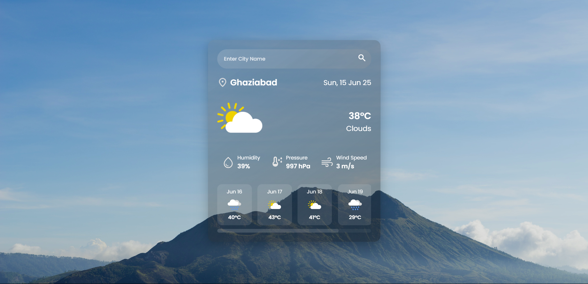

# 🌦️ Weather Web Application

A sleek and responsive web-based Weather Application that displays real-time weather data for any city using HTML, CSS, and JavaScript. The app fetches live data from a weather API and displays temperature, weather conditions, humidity, wind speed, and more. It’s fully responsive and mobile-friendly.

<h3>🚀 Live Demo</h3>

Below Is the Website Link(deployed Version) that will Lead you to your Personal Weather Forecast Application:- 

🔗 Click here to visit the live app:
https://weather-app-five-gamma-22.vercel.app/

---

📌 Features

🌍 Search for current weather by city name

🌡️ Display temperature in Celsius or Fahrenheit

☁️ Shows weather description and icon

💧 Displays humidity and wind speed

📱 Responsive design for all screen sizes

⚙️ Error handling for invalid city names

🔄 Real-time data using OpenWeatherMap API

---

💠 Tech Stack

Technology	Purpose

HTML	Page structure
CSS	Styling & layout
JavaScript	Logic & API handling
OpenWeatherMap API	Weather data

---

📂 Project Structure

weather-app/
├── index.html
├── style.css
├── script.js
├── assets/
│   └── icons/ (optional)
└── README.md

---

⚙️ Setup Instructions

1. Clone the repository

git clone https://github.com/KunalxKushwaha/Weather-App.git
cd weather-App

2. Add your OpenWeatherMap API key

Replace YOUR_API_KEY in script.js with your actual OpenWeatherMap API key.

const apiKey = "YOUR_API_KEY";

Get your free API key from OpenWeatherMap.

3. Open in browser

Just open index.html in your preferred web browser.

---

🌐 Deployment

This project is deployed using GitHub Pages / Vercel / Netlify.

> 🟢 Live at: https://weather-app-five-gamma-22.vercel.app/

To deploy yourself:

Push your code to a GitHub repository

Connect to Netlify / Vercel or enable GitHub Pages

---

📸 Preview

---

📝 License

This project is licensed under the MIT License.

---

GitHub: @KunalKushwaha

Twitter: @kunalkushwaha

LinkedIn: linkedin.com/in/kunalkushwaha

⭐️ Show Your Support

If you liked this project, feel free to ⭐️

# 🤛♂️ Author- Kunal Kushwaha

